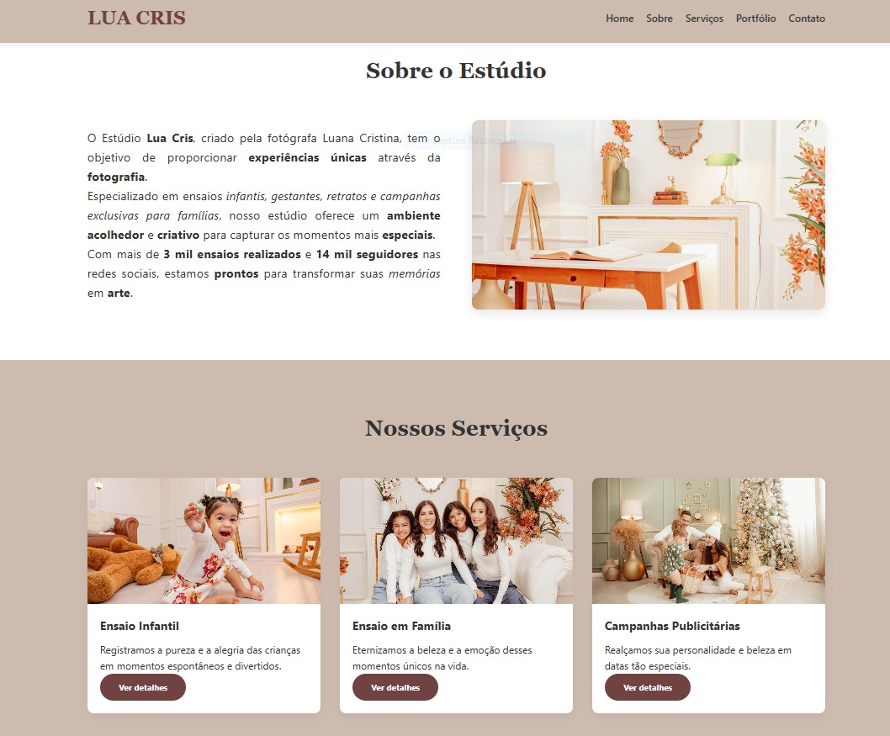
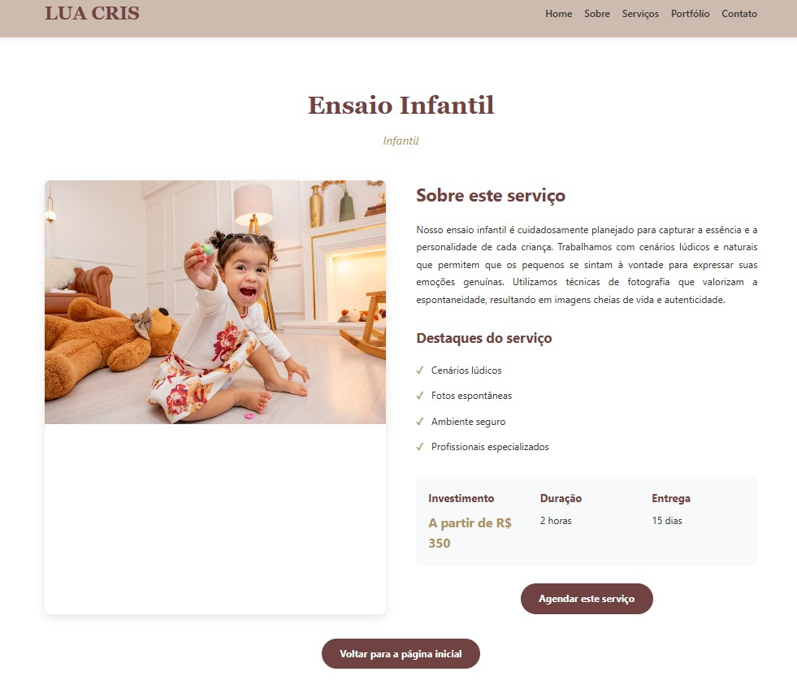

# Trabalho Prático 05 - Semanas 7 e 8

**Páginas de detalhes dinâmicas**

Nessa etapa, vamos evoluir o trabalho anterior, acrescentando a página de detalhes, conforme o  projeto escolhido. Imagine que a página principal (home-page) mostre um visão dos vários itens que existem no seu site. Ao clicar em um item, você é direcionado pra a página de detalhes. A página de detalhe vai mostrar todas as informações sobre o item do seu projeto. seja esse item uma notícia, filme, receita, lugar turístico ou evento.

Leia o enunciado completo no Canvas. 

**IMPORTANTE:** Assim como informado anteriormente, capriche na etapa pois você vai precisar dessa parte para as próximas semanas. 

**IMPORTANTE:** Você deve trabalhar e alterar apenas arquivos dentro da pasta **`public`,** mantendo os arquivos **`index.html`**, **`styles.css`** e **`app.js`** com estes nomes, conforme enunciado. Deixe todos os demais arquivos e pastas desse repositório inalterados. **PRESTE MUITA ATENÇÃO NISSO.**

## Informações Gerais

- Nome: Eduardo Lopes Araujo Pêgo
- Matricula: 902371
- Proposta de projeto escolhida: Estúdio de fotografia
- Breve descrição sobre seu projeto:

## Print da Home-Page



## Print da página de detalhes do item



## Cole aqui abaixo a estrutura JSON utilizada no app.js


```javascript
const dadosServicos = [
  {
    "id": 1,
    "titulo": "Ensaio Infantil",
    "descricao": "Registramos a pureza e a alegria das crianças em momentos espontâneos e divertidos.",
    "conteudo": "Nosso ensaio infantil é cuidadosamente planejado para capturar a essência e a personalidade de cada criança. Trabalhamos com cenários lúdicos e naturais que permitem que os pequenos se sintam à vontade para expressar suas emoções genuínas. Utilizamos técnicas de fotografia que valorizam a espontaneidade, resultando em imagens cheias de vida e autenticidade.",
    "categoria": "Infantil",
    "preco": "A partir de R$ 350",
    "duracao": "2 horas",
    "entrega": "15 dias",
    "imagem": "adress/endaio infantil.jpeg",
    "destaques": ["Cenários lúdicos", "Fotos espontâneas", "Ambiente seguro", "Profissionais especializados"]
  },
  {
    "id": 2,
    "titulo": "Ensaio em Família",
    "descricao": "Eternizamos a beleza e a emoção desses momentos únicos na vida.",
    "conteudo": "O ensaio em família é uma oportunidade única de registrar o amor e a conexão entre seus entes queridos. Trabalhamos tanto em estúdio quanto em locações externas, adaptando-nos ao estilo e personalidade de cada família. Nossas sessões são descontraídas e divertidas, focadas em capturar interações genuínas e momentos especiais que contarão a história da sua família por gerações.",
    "categoria": "Família",
    "preco": "A partir de R$ 500",
    "duracao": "3 horas",
    "entrega": "20 dias",
    "imagem": "adress/ensaio em familia dois.jpeg",
    "destaques": ["Locação interna ou externa", "Interações genuínas", "Orientação de styling", "Fotos para todas as gerações"]
  },
  {
    "id": 3,
    "titulo": "Campanhas Publicitárias",
    "descricao": "Realçamos sua personalidade e beleza em datas tão especiais.",
    "conteudo": "Especializados em campanhas publicitárias e fotografia comercial, criamos imagens que comunicam efetivamente a identidade da sua marca. Desenvolvemos conceitos criativos aliados à técnica fotográfica para produzir material visual de alto impacto. Trabalhamos com produtos, serviços, moda e retratos corporativos, sempre com atenção aos detalhes e à qualidade final.",
    "categoria": "Comercial",
    "preco": "Sob consulta",
    "duracao": "Variável",
    "entrega": "10-15 dias",
    "imagem": "adress/campanhas pubblicitarias.jpeg",
    "destaques": ["Conceito criativo", "Direção de arte", "Alta qualidade técnica", "Versatilidade de uso"]
  }
];

const dadosPortfolio = [
  {
    "id": 1,
    "titulo": "Ensaio Infantil",
    "categoria": "Infantil",
    "imagem": "adress/endaio infantil  dois.jpeg",
    "descricao": "Sessão temática de primavera"
  },
  {
    "id": 2,
    "titulo": "Família",
    "categoria": "Família",
    "imagem": "adress/ensaio em familia.jpeg",
    "descricao": "Ensaio em parque natural"
  },
  {
    "id": 3,
    "titulo": "Campanha Moda Verão",
    "categoria": "Comercial",
    "imagem": "adress/principal.jpeg",
    "descricao": "Coleção resort 2024"
  },
  {
    "id": 4,
    "titulo": "Ensaio de gestante",
    "categoria": "Infantil",
    "imagem": "adress/gravida dois.jpeg",
    "descricao": "A mulher no seu momento mais especial"
  }
];